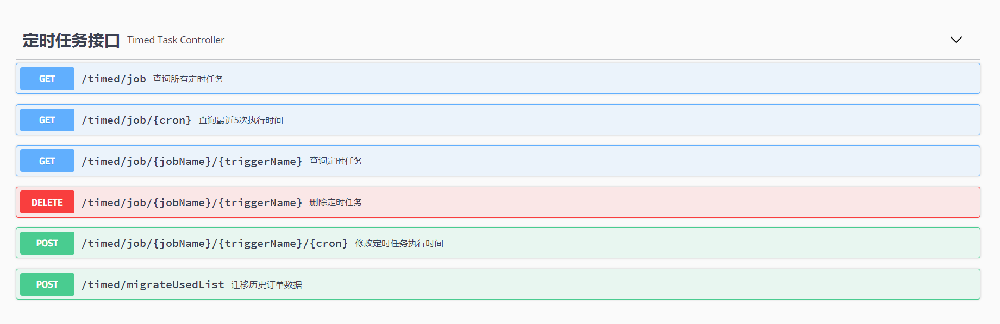

## 项目简介
springboot 2.3.1 + quartz 2.3.1 搭建定时任务骨架项目。

### 一、Maven依赖
```xml
<dependency>
    <groupId>org.quartz-scheduler</groupId>
    <artifactId>quartz</artifactId>
    <version>2.3.1</version>
</dependency>
```
### 二、项目功能
- 基于quartz2.3.1实现动态管理定时任务。
- 基于swagger实现接口文档
- 前后端统一使用JSON格式交互

### 三、swagger文档


### 四、关注公众号回复[book]PDF资料
